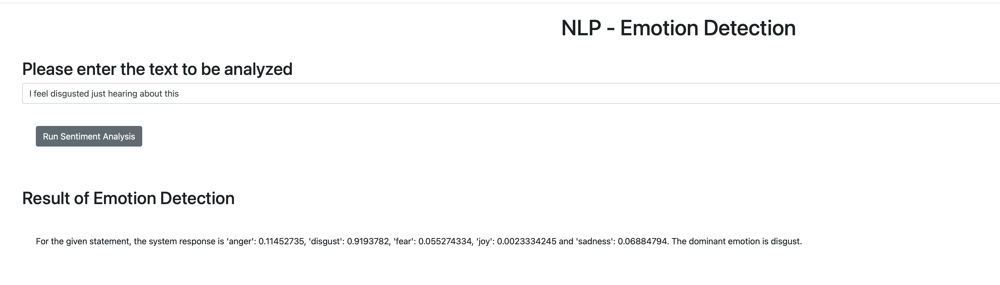
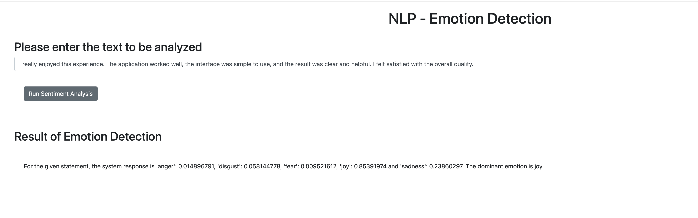

# NLP Emotion Detection with Python and Flask

Final project for IBM's **Developing AI Applications with Python and Flask** course on Coursera.

This project is a small Flask web application that detects the dominant emotion in a user-provided English sentence. The application sends text to an NLP emotion detection service, receives emotion scores, and displays the most likely emotion in the browser.

## Project Overview

The application analyzes text across five emotions:

- anger
- disgust
- fear
- joy
- sadness

For each request, the backend returns the score for each emotion and identifies the dominant emotion.

## Screenshots

### Disgust Detection



### Joy Detection



## Features

- Flask web server with a browser-based interface.
- Emotion analysis endpoint exposed through `/emotionDetector`.
- Integration with the Watson NLP emotion prediction service provided by Skills Network.
- Frontend request handling with JavaScript and `XMLHttpRequest`.
- Bootstrap-based UI.
- Invalid input handling for empty or rejected text.
- Unit tests covering the expected dominant emotion for joy, anger, disgust, sadness, and fear examples.

## Tech Stack

- Python
- Flask
- Requests
- HTML
- JavaScript
- Bootstrap
- unittest

## How It Works

1. The user enters a sentence in the web interface.
2. `static/mywebscript.js` sends the text to the Flask route `/emotionDetector`.
3. `server.py` receives the request and calls `emotion_detector`.
4. `EmotionDetection/emotion_detection.py` sends the text to the Watson NLP emotion prediction endpoint.
5. The response is parsed into emotion scores.
6. The application calculates the dominant emotion and returns a formatted result to the page.

## Project Structure

```text
.
|-- EmotionDetection/
|   |-- __init__.py
|   `-- emotion_detection.py
|-- docs/
|   `-- images/
|       |-- emotion-detection-disgust.png
|       `-- emotion-detection-joy.png
|-- static/
|   `-- mywebscript.js
|-- templates/
|   `-- index.html
|-- server.py
|-- test_emotion_detection.py
|-- LICENSE
`-- README.md
```

## Running Locally

Create and activate a virtual environment:

```bash
python3 -m venv .venv
source .venv/bin/activate
```

Install the required dependencies:

```bash
pip install flask requests
```

Start the Flask application:

```bash
python server.py
```

Open the application in your browser:

```text
http://localhost:5000
```

## Running Tests

```bash
python test_emotion_detection.py
```

The tests call the external emotion detection service, so they require an internet connection and the service endpoint to be available.

## Example Outputs

Input:

```text
I feel disgusted just hearing about this
```

Dominant emotion:

```text
disgust
```

Input:

```text
I really enjoyed this experience. The application worked well, the interface was simple to use, and the result was clear and helpful.
```

Dominant emotion:

```text
joy
```

## Course Context

This repository was completed as part of the IBM/Coursera course **Developing AI Applications with Python and Flask**. The project focuses on applying Python backend development, Flask routing, API integration, unit testing, and basic frontend interaction to build a working AI-powered web application.

## License

This project is licensed under the Apache License 2.0. See [LICENSE](LICENSE) for details.
